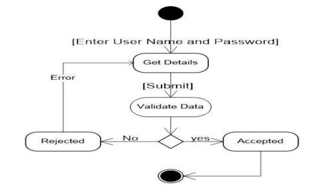
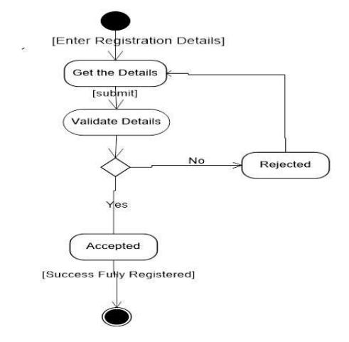
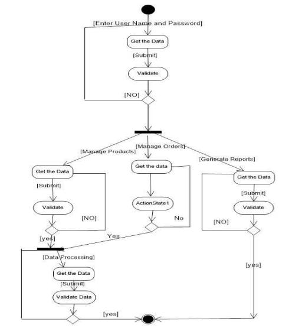
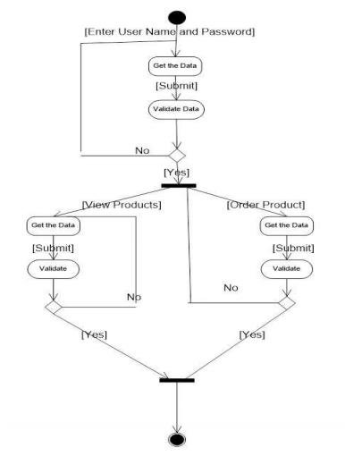
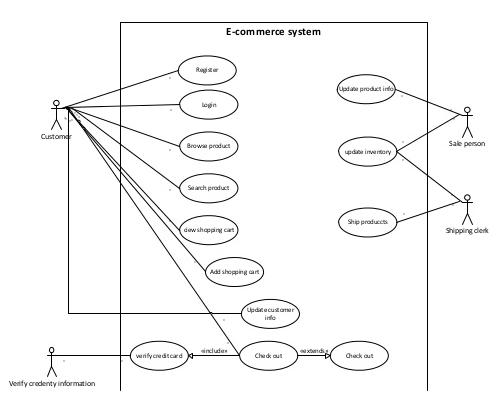
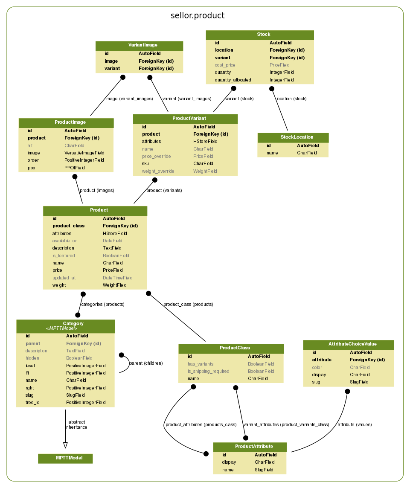
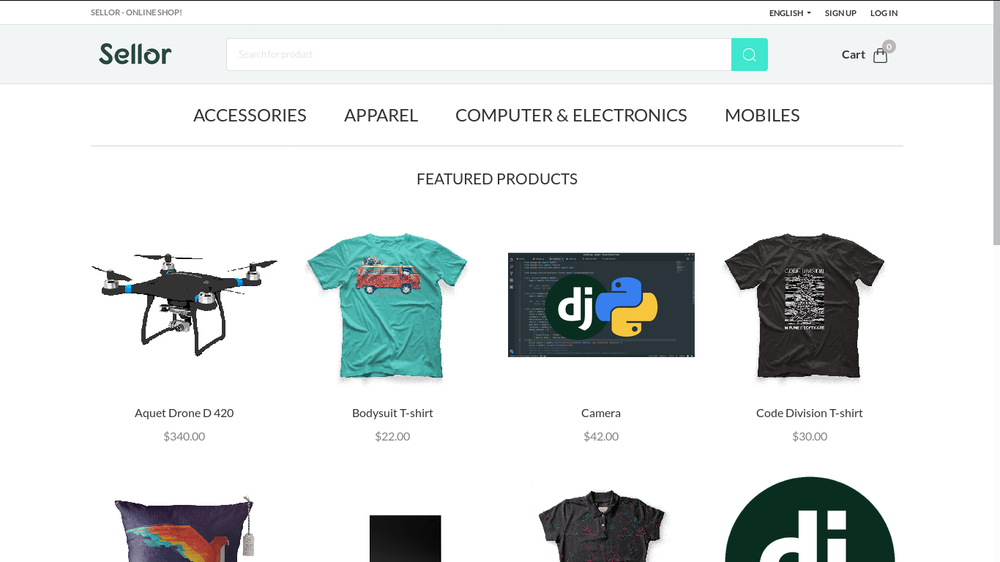

Handling Money Amounts
======================

Sellor uses the `Prices <https://github.com/mirumee/prices/>`_ and `django-prices <https://github.com/mirumee/django-prices/>`_ libraries to store, calculate and display amounts of money, prices and ranges of those and `django-prices-vatlayer <https://github.com/mirumee/django-prices-vatlayer>`_ to handle money ammounts. Money amounts are stored on model using `MoneyField` that provides its own safechecks on currency and precision of stored amount.

Default currency
----------------

All prices are entered and stored in a single default currency controlled by the :ref:`DEFAULT_CURRENCY <settings_configuration>` settings key. Sellor can display prices in a user's local currency (see :ref:`openexchangerates`) but all purchases are charged in the default currency.

.. warning::

  The currency is not stored in the database. Changing the default currency in a production environment will not recalculate any existing orders. All numbers will remain the same and will be incorrectly displayed as the new currency.

Money
-----

In Sellor's codebase, money amounts exist as `Money` instance.

`Money` is a type representing amount of money in specific currency: 100 USD is represented by `Money(100, 'USD')`.
This type doesn't hold any additional information useful for commerce but, unlike `Decimal`, it implements safeguards and checks for calculations and comparisons of monetary values.

Money amounts are stored on model using `MoneyField` that provides its own safechecks on currency and precision of stored amount.

If you ever need to get to the `Decimal` of your `Money` object, you'll find it on the `amount` property.

Products and shipping methods prices are stored using `MoneyField`. All prices displayed in dashboard, excluding orders, are as they have been entered in the forms. You can decide if those prices are treated as gross or net in dashboard.

Prices displayed in orders are gross or net depending on setting how prices are displayed for customers, both in storefront and dashboard. This way staff users will always see the same state of an order as the customer.

MoneyRange
----------

Sometimes a product may be available under more than single price due to its variants defining custom prices different from the base price.

For such situations `Product` defines additional `get_price_range` method that return `MoneyRange` object defining minimum and maximum prices on its `start` and `stop` attributes.
This object is then used by the UI to differentiate between displaying price as "10 USD" or "from 10 USD" in case of products where prices differ between variants.

Product Structure
=================

Before filling your shop with products we need to introduce 3 product concepts - *product types*, *products*, *product variants*.

Overview
--------

Consider a book store. One of your *products* is a book titled "Introduction to Sellor".

The book is available in hard and soft cover, so there would be 2 *product variants*.

Type of cover is the only attribute which creates separate variants in our store, so we use *product type* named "Book" with variants enabled and a "Cover type" *variant attribute*.

Product Variants
----------------

Variants are the most important objects in your shop. All cart and stock operations use variants. Even if a product doesn't have multiple variants, the store will create one under the hood.

Products
--------

Describes common details of a few *product variants*. When the shop displays the category view, items on the list are distinct *products*. If the variant has no overridden property (example: price), the default value is taken from the *product*.

- ``publication_date``
    Until this date the product is not listed in storefront and is unavailable for users.

- ``is_featured``
    Featured products are displayed on the front page.

Product Types
---------------

Think about types as templates for your products. Multiple *products* can use the same product type.

- ``product_attributes``
    Attributes shared among all *product variants*. Example: publisher; all book variants are published by same company.

- ``variant_attributes``
    It's what distinguishes different *variants*. Example: cover type; your book can be in hard or soft cover.

- ``is_shipping_required``
    Indicates whether purchases need to be delivered. Example: digital products; you won't use DHL to ship an MP3 file.

- ``has_variants``
    Turn this off if your *product* does not have multiple variants or if you want to create separate *products* for every one of them.

    This option mainly simplifies product management in the dashboard. There is always at least one *variant* created under the hood.

.. warning:: Changing a product type affects all products of this type.

.. warning:: You can't remove a product type if there are products of that type.

Attributes
----------

*Attributes* can help you better describe your products. Also, the can be used to filter items in category views.

The attribute values display in the storefront in the order that they are listed in the list in attribute details view. You can reorder them by handling an icon on the left to the values and dragging them to another position.

There are 2 types of *attributes* - choice type and text type. If you don't provide choice values, then attribute is text type.

Examples
~~~~~~~~

* *Choice type*: Colors of a t-shirt (for example 'Red', 'Green', 'Blue')
* *Text type*: Number of pages in a book

Example: Coffee
~~~~~~~~~~~~~~~

Your shop sells Coffee from around the world. Customer can order 1kg, 500g and 250g packages. Orders are shipped by couriers. 

.. table:: Coffee - Attributes

   =================  ===========
   Attribute          Values
   =================  ===========
   Country of origin  * Brazil
                      * Vietnam
                      * Colombia
                      * Indonesia
   Package size       * 1kg
                      * 500g
                      * 250g
   =================  ===========

.. table:: Coffee - Product type

   ======  ===================  =========  ==================  =========
   Name    Product attributes   Variants?  Variant attributes  Shipping?
   ======  ===================  =========  ==================  =========
   Coffee  * Country of origin  Yes        * Package size      Yes
   ======  ===================  =========  ==================  =========

.. table:: Coffee - Product

   ============  ================  =================  =================================
   Product type  Name              Country of origin  Description
   ============  ================  =================  =================================
   Coffee        Best Java Coffee  Indonesia          Best coffee found on Java island!
   ============  ================  =================  =================================

.. table:: Coffee - Variants
   :widths: 30 30 40 

   ====  ============  ==============
   SKU   Package size  Price override
   ====  ============  ==============
   J001  1kg           $20
   J002  500g          $12
   J003  250g          $7
   ====  ============  ==============

Example: Online game items
~~~~~~~~~~~~~~~~~~~~~~~~~~

You have great selection of online games items. Each item is unique, important details are included in description. Bought items are shipped directly to buyer account.

.. table:: Online Game Items - Attributes

   ==========  ================
   Attribute   Values
   ==========  ================
   Game        * Kings Online
               * War MMO
               * Target Shooter
   Max attack  ---
   ==========  ================

.. table:: Online Game Items - Product type

   =========  ==================  =========  ==================  =========
   Name       Product attributes  Variants?  Variant attributes  Shipping?
   =========  ==================  =========  ==================  =========
   Game item  * Game              No         ---                 No
              * Max attack
   =========  ==================  =========  ==================  =========

.. table:: Online Game Items - Products

   ============  ================  =======  ==============  ==========  =================================
   Product type  Name              Price    Game            Max attack  Description
   ============  ================  =======  ==============  ==========  =================================
   Game item     Magic Fire Sword  $199     Kings Online    8000        Unique sword for any fighter.
   Game item     Rapid Pistol      $2500    Target Shooter  250         Fastest pistol in the whole game.
   ============  ================  =======  ==============  ==========  =================================

Thumbnails
==========

Sellor uses `VersatileImageField <https://github.com/respondcreate/django-versatileimagefield>`_ replacement for Django's ImageField.
For performance reasons, in non-debug mode thumbnails are pregenerated by the worker's task, fired after saving the instance.
Accessing missing image will result in 404 error.

In debug mode thumbnails are generated on demand.

Generating Products Thumbnails Manually
---------------------------------------

Create missing thumbnails for all ProductImage instances.

.. code-block:: console

 $ python manage.py create_thumbnails

Deleting Images
---------------

Image renditions are not deleted automatically with the Image instance, so is the main image.
More on deleting images can be found in `VersatileImageField documentation <https://django-versatileimagefield.readthedocs.io/en/latest/deleting_created_images.html>`_

Stock Management
================

Each product variant has a stock keeping unit (SKU).

Each variant holds information about *quantity* at hand, quantity *allocated* for already placed orders and quantity *available*.

**Example:** There are five boxes of shoes. Three of them have already been sold to customers but were not yet dispatched for shipment. The stock records **quantity** is **5**, **quantity allocated** is **3** and **quantity available** is **2**.

Each variant also has a *cost price* (the price that your store had to pay to obtain it).

Product Availability
--------------------

A variant is *in stock* if it has unallocated quantity.

The highest quantity that can be ordered is the available quantity in product variant.

Allocating Stock for New Orders
-------------------------------

Once an order is placed, quantity needed to fulfil each order line is immediately marked as *allocated*.

**Example:** A customer places an order for another box of shoes. The stock records **quantity** is **5**, **quantity allocated** is now **4** and **quantity available** becomes **1**.

Decreasing Stock After Shipment
-------------------------------

Once order lines are marked as shipped, each corresponding stock record will have both its quantity at hand and quantity allocated decreased by the number of items shipped.

**Example:** Two boxes of shoes from warehouse A are shipped to a customer. The stock records **quantity** is now **3**, **quantity allocated** becomes **2** and **quantity available** stays at **1**.

Order Management
================

Orders are created after customers complete the checkout process. The `Order` object itself contains only general information about the customer's order.

Fulfillment
-----------

The fulfillment represents a group of shipped items with corresponding tracking number. Fulfillments are created by a shop operator to mark selected products in an order as fulfilled.

There are two possible fulfillment statuses:

- ``NEW``
    The default status of newly created fulfillments.

- ``CANCELED``
    The fulfillment canceled by a shop operator. This action is irreversible.

Order statuses
--------------

There are four possible order statuses, based on statuses of its fulfillments:

- ``UNFULFILLED``
    There are no fulfillments related to an order or each one is canceled. An action by a shop operator is required to continue order processing.

- ``PARTIALLY FULFILLED``
    There are some fulfillments with ``FULFILLED`` status related to an order. An action by a shop operator is required to continue order processing.

- ``FULFILLED``
    Each order line is fulfilled in existing fulfillments. Order doesn't require further actions by a shop operator.

- ``CANCELED``
    Order has been canceled. Every fulfillment (if there is any) has ``CANCELED`` status. Order doesn't require further actions by a shop operator.

There is also ``DRAFT`` status, used for orders newly created from dashboard and not yet published.

Events
======

.. note::
    Events are autogenerated and will be triggered
    when certain actions are completed, such us creating the order,
    cancelling fulfillment or completing a payment.

Order Events
------------

.. table:: Order Events
   :widths: 28 28 44

   +---------------------------+---------------------------+---------------------------------------------------------------+
   | Code                      | API value                 | Description                                                   |
   +---------------------------+---------------------------+---------------------------------------------------------------+
   | ``placed``                | ``PLACED``                | An order was placed by the customer.                          |
   +---------------------------+---------------------------+---------------------------------------------------------------+
   | ``draft_placed``          | ``FROM_DRAFT``            | An order was created from draft by the staff user.            |
   +---------------------------+---------------------------+---------------------------------------------------------------+
   | ``oversold_items``        | ``OVERSOLD_ITEMS``        | An order was created from draft.                              |
   +---------------------------+---------------------------+---------------------------------------------------------------+
   | ``canceled``              | ``CANCELED``              | The order was cancelled.                                      |
   +---------------------------+---------------------------+---------------------------------------------------------------+
   | ``order_paid``            | ``ORDER_PAID``            | The order was fully paid by the customer.                     |
   +---------------------------+---------------------------+---------------------------------------------------------------+
   | ``marked_as_paid``        | ``MARKED_AS_PAID``        | The order was manually marked as fully paid by the staff user.|
   +---------------------------+---------------------------+---------------------------------------------------------------+
   | ``updated``               | ``UPDATED``               | The order was updated.                                        |
   +---------------------------+---------------------------+---------------------------------------------------------------+
   | ``email_sent``            | ``EMAIL_SENT``            | An email was sent to the customer.                            |
   +---------------------------+---------------------------+---------------------------------------------------------------+
   | ``captured``              | ``CAPTURED``              | The payment was captured.                                     |
   +---------------------------+---------------------------+---------------------------------------------------------------+
   | ``refunded``              | ``REFUNDED``              | The payment was refunded.                                     |
   +---------------------------+---------------------------+---------------------------------------------------------------+
   | ``voided``                | ``VOIDED``                | The payment was voided.                                       |
   +---------------------------+---------------------------+---------------------------------------------------------------+
   | ``fulfill_canceled``      | ``FULFILL_CANCELED``      | Fulfillment for one or more of the items was canceled.        |
   +---------------------------+---------------------------+---------------------------------------------------------------+
   | ``restock_items``         | ``RESTOCK_ITEMS``         | One or more of the order's items have been resocked           |
   +---------------------------+---------------------------+---------------------------------------------------------------+
   | ``fulfill_items``         | ``FULFILL_ITEMS``         | One or more of the order's items have been fulfilled.         |
   +---------------------------+---------------------------+---------------------------------------------------------------+
   | ``note_added``            | ``NOTE_ADDED``            | A note was added to the order by the staff.                   |
   +---------------------------+---------------------------+---------------------------------------------------------------+
   | ``other``                 | ``OTHER``                 | Status used during reimporting of the legacy events.          |
   +---------------------------+---------------------------+---------------------------------------------------------------+

Internationalization
====================

By default language and locale are determined based on the list of preferences supplied by a web browser. GeoIP is used to determine the visitor's country and their local currency.

.. note::

    Sellor uses Transifex to coordinate translations. If you wish to help please head to the `translation dashboard <https://www.transifex.com/mirumee/Sellor-1/>`_.

    All translations are handled by the community. All translation teams are open and everyone is welcome to request a new language.

Translation
-----------

Sellor uses ``gettext`` for translation. This is an industry standard for translating software and is the most common way to translate Django applications.

Sellor's storefront and dashboard are both prepared for translation. They use separate translation domains and can be translated separately. All translations provide accurate context descriptions to make translation an easier task.

It is possible to translate database content (like product descriptions) with Sellor, more on it can be found in the `Model Translations` section.

Localization
------------

1. Data formats
~~~~~~~~~~~~~~~

Sellor uses `Babel <http://babel.pocoo.org/en/latest/>`_ as the interface to Unicode's CLDR library to provide accurate number and date formatting as well as proper currency designation.

2. Address forms
~~~~~~~~~~~~~~~~

`Google's address format database <https://github.com/mirumee/google-i18n-address>`_ is used to provide locale-specific address formats and forms. It also takes care of address validation so you don't have to know how to address a package to China or whether United Arab Emirates use postal codes (they don't).

3. Currency conversion
~~~~~~~~~~~~~~~~~~~~~~

Sellor can use currency exchange rate data to show price estimations in the visitor's local currency. Please consult `Open Exchange Rates` for how to set this up for `Open Exchange Rates <https://openexchangerates.org/>`_.

4. Phone numbers format
~~~~~~~~~~~~~~~~~~~~~~~

Sellor uses `Google's libphonenumber library <https://github.com/googlei18n/libphonenumber>`_ to ensure provided numbers are correct. You need to choose prefix and type the number separately. No matter what country has been chosen, you may enter phone number belonging to any other country format.

Model Translations
==================

.. note::

    At this stage, model translations are only accessible from the Python code.
    The backend and the storefront are prepared to handle the translated properties, but
    GraphQL API and UI views will be added in the future releases.

Overview
--------

Model translations are available via ``TranslationProxy`` defined on the to-be-translated ``Model``.

``TranslationProxy`` gets user's language, and checks if there's a ``ModelTranslation`` created for that language.

If there's no relevant ``ModelTranslation`` available, it will return the original (therefore not translated) property.
Otherwise, it will return the translated property.

Adding a ModelTranslation
-------------------------

Consider a product.

.. code-block:: python

   from django.db import models

   from sellor.core.utils.translations import TranslationProxy

   class Product(models.Model):
       name = models.CharField(max_length=128)
       description = models.CharField(max_length=256)
       ...

       translated = TranslationProxy()

The product has several properties, but we want to translate just its ``name`` and ``description``.

We've also set a ``translated`` property to an instance of ``TranslationProxy``.

We will use ``ProductTranslation``  to store our translated properties, it requires two base fields:

- ``language_code``
    A language code that this translation correlates to.

- ``product``
    ``ForeignKey`` relation to the translated object (in this case we named it *product*)

... and any other field you'd like to translate, in our example, we will use ``name`` and ``description``.

.. warning:: ``TranslationProxy`` expects that the ``related_name``, on the ``ForeignKey`` relation is set to ``translations``

.. code-block:: python

   from django.db import models

   class ProductTranslation(models.Model):
       language_code = models.CharField(max_length=10)
       product = models.ForeignKey(
           Product, related_name='translations', on_delete=models.CASCADE)
       name = models.CharField(max_length=128)
       description = models.CharField(max_length=256)

       class Meta:
           unique_together = ('product', 'language_code')

.. note:: Don't forget to set ``unique_together`` on the ``product`` and ``language_code``, there should be only one translation per product per language.

.. warning:: ``ModelTranslation`` fields must always take the same arguments as the existing translatable model, eg. inconsistency in ``max_length`` attribute could lead to UI bugs with translation turned on.

Using a ModelTranslation
------------------------

Given the example above, we can access translated properties via the ``TranslationProxy``.

.. code-block:: python

    translated_name = product.translated.name

.. note:: Translated property will be returned if there is a ``ModelTranslation`` with the same ``language_code`` as a user's currently active language. Otherwise, the original property will be returned.

Search
======

There are two search mechanisms available in Sellor.

The default is to use PostgreSQL. This is a fairly versatile solution that does not require any additional resources.

A more sophisticated search backend can be enabled if an Elasticsearch server is available. Elasticsearch offers a lot of advanced features, such as boosting to tune the relevance of a query or "more like this" queries. See the `official Elasticsearch website <https://www.elastic.co/products/elasticsearch>`_ to read more about its features. Please note that enabling the Elasticsearch backend does not currently enable any additional features in Sellor.

For installation and configuration instructions see :ref:`elasticsearch`.

Payments Architecture
=====================

Supported Payment Gateways
--------------------------

#. Braintree (supports PayPal and Credit Cards)

#. Stripe (supports Credit Cards)

1. Braintree (supports PayPal and Credit Cards)
~~~~~~~~~~~~~~~~~~~~~~~~~~~~~~~~~~~~~~~~~~~~~~~

This gateway implements payments using `Braintree <https://www.braintreepayments.com/>`_.

.. table:: Braintree Environment Variables
   :widths: 40 60

   ==========================  =================================================================================
   Environment variable        Description
   ==========================  =================================================================================
   ``BRAINTREE_SANDBOX_MODE``  Whether to use a sandbox environment for testing, ``True`` (default) or ``False``
   ``BRAINTREE_MERCHANT_ID``   Merchant ID assigned by Braintree
   ``BRAINTREE_PUBLIC_KEY``    Public key assigned by Braintree
   ``BRAINTREE_PRIVATE_KEY``   Private key assigned by Braintree
   ==========================  =================================================================================

.. note::
  This backend does not support fraud detection.
    
.. warning::
  Make sure that Braintree's currency is the same as your shop's, otherwise, customers will be charged the wrong amount.
  
 
2. Stripe (supports Credit Cards)
~~~~~~~~~~~~~~~~~~~~~~~~~~~~~~~~~

This gateway implements payments using `Stripe <https://stripe.com/>`_.

.. table:: Stripe Environment variables
   :widths: 40 60

   ==================================  =====================================================================================
   Environment variable                Description
   ==================================  =====================================================================================
   ``STRIPE_PUBLIC_KEY``               Your Stripe public key (test or live)
   ``STRIPE_SECRET_KEY``               Your Stripe secret key (test or live)
   ``STRIPE_STORE_NAME``               Your store name to show in the checkout form.
   ``STRIPE_STORE_IMAGE``              An absolute or relative link of your store logo.
   ``STRIPE_PREFILL``                  Prefill the email adddress in the checkout form if set to ``True`` (default)
   ``STRIPE_REMEMBER_ME``              For future purchases in the checkout form if set to ``True`` (default)
   ``STRIPE_LOCALE``                   Specify ``auto`` to display checkout form in the user's preferred language (default)
   ``STRIPE_BILLING_ADDRESS``          Collect the user's billing address in the checkout form if set to ``True``.
   ``STRIPE_SHIPPING_ADDRESS``         Collect the user's shipping address in the checkout form if set to ``True``.
   ==================================  =====================================================================================

The default configuration only uses the dummy backend (see `how to enable/disable payment gateways`). It’s meant to allow developers to easily simulate different payment results.

For an how-to guide on adding new payments into your Sellor project please check `Payments`.

.. note:: All payment backends default to using sandbox mode. This is very useful for development but make sure you use production mode when deploying to a production server.

Authorization and Capture
-------------------------

Some of the payment backends support pre-authorizing payments.

Authorization and capture is a two-step process.

Firstly the funds are locked on the payer's account but are not transferred to your bank.

Then depending on the gateway and the card type, you have between a few days and a month to charge the card for an amount not exceeding the authorized amount.

This is very useful when an exact price cannot be determined until after the order is prepared,
or we want to capture the money as soon as we ship the order.
It is also useful if your business prefers to manually screen orders for fraud attempts.

When viewing orders with pre-authorized payments Sellor will offer options to either capture or void the funds.

Refunds
-------

You can issue partial or full refunds for all captured payments.
When editing an order and removing items, Sellor will also offer to automatically issue a partial refund.

Sellor uses the concept of Payments and Transactions to fulfill the payment process.

Payment Methods
---------------

Represents transactable payment information such as credit card details,
gift card information or a customer's authorization to charge their PayPal account.

All payment process related pieces of information are stored at the gateway level,
we are operating on the reusable token which is a unique identifier
of the customer for given gateway.

Several payment methods can be used within a single order.

Payment has 3 possible charge statuses:

.. table:: Possible Charge Statuses
   :widths: 26 26 48

   +----------------+-------------------+----------------------------------------------------------------------------------+
   | Code           | API value         | Description                                                                      |
   +----------------+-------------------+----------------------------------------------------------------------------------+
   | charged        | CHARGED           | Funds were taken off the customer founding source.                               |
   +----------------+-------------------+----------------------------------------------------------------------------------+
   | not-charged    | NOT_CHARGED       | No funds were take off the customer founding source yet.                         |
   +----------------+-------------------+----------------------------------------------------------------------------------+
   | fully-refunded | FULLY_REFUNDED    | All charged funds were returned to the customer.                                 |
   +----------------+-------------------+----------------------------------------------------------------------------------+

Transactions
------------

Transaction represent attempts to transfer money between your store
and your customers, within a chosen payment method.

There are 5 possible transaction kinds:

.. table:: Possible Transaction Kinds
   :widths: 20 20 60

   +---------+-------------------+-----------------------------------------------------------------------------------------+
   | Code    | API value         | Description                                                                             |
   +---------+-------------------+-----------------------------------------------------------------------------------------+
   | auth    | AUTH              | An amount reserved against the customer's funding source.                               |
   +---------+-------------------+-----------------------------------------------------------------------------------------+
   | capture | CAPTURE           | A transfer of the money that was reserved during the authorization stage.               |
   +---------+-------------------+-----------------------------------------------------------------------------------------+
   | charge  | CHARGE            | Authorization and capture in a single step.                                             |
   +---------+-------------------+-----------------------------------------------------------------------------------------+
   | void    | VOID              | A cancellation of a pending authorization or capture.                                   |
   +---------+-------------------+-----------------------------------------------------------------------------------------+
   | refund  | REFUND            | Full or partial return of captured funds to the customer.                               |
   +---------+-------------------+-----------------------------------------------------------------------------------------+

Transaction errors
------------------

Sellor unifies error codes across all gateways.

.. table:: Transaction Errors
   :widths: 25 35 40

   +---------------------+---------------------+----------------------------------------------------------------------+
   | Code                | API value           | Description                                                          |
   +---------------------+---------------------+----------------------------------------------------------------------+
   | incorrect_number    | INCORRECT_NUMBER    | Incorrect card number                                                |
   +---------------------+---------------------+----------------------------------------------------------------------+
   | invalid_number      | INVALID_NUMBER      | Invalid card number                                                  |
   +---------------------+---------------------+----------------------------------------------------------------------+
   | incorrect_cvv       | INCORRECT_CVV       | Incorrect CVV (or CVC)                                               |
   +---------------------+---------------------+----------------------------------------------------------------------+
   | invalid_cvv         | INVALID_CVV         | Invalid CVV (or CVC)                                                 |
   +---------------------+---------------------+----------------------------------------------------------------------+
   | incorrect_zip       | INCORRECT_ZIP       | Incorrect postal code                                                |
   +---------------------+---------------------+----------------------------------------------------------------------+
   | incorrect_address   | INCORRECT_ADDRESS   | Incorrect address (excluding postal code)                            |
   +---------------------+---------------------+----------------------------------------------------------------------+
   | invalid_expiry_date | INVALID_EXPIRY_DATE | Incorrect card's expiration date                                     |
   +---------------------+---------------------+----------------------------------------------------------------------+
   | expired             | EXPIRED             | Expired payment's method token                                       |
   +---------------------+---------------------+----------------------------------------------------------------------+
   | declined            | DECLINED            | Transaction was declined by the gateway                              |
   +---------------------+---------------------+----------------------------------------------------------------------+
   | processing_error    | PROCESSING_ERROR    | Default error used for all cases not covered above                   |
   +---------------------+---------------------+----------------------------------------------------------------------+

Shippings
=========

Sellor uses the concept of Shipping Zones and Shipping Methods to fulfill the shipping process.

Shipping Zones
--------------

The countries that you ship to are known as the shipping zones. Each ``ShippingZone`` includes ``ShippingMethods`` that apply to customers whose shipping address is within the shipping zone.

Each ``ShippingZone`` can contain several countries inside, but the country might belong to a maximum of one ``ShippingZone``.

Some examples of the ``ShippingZones`` could be `European Union`, `North America`, `Germany` etc.

There's also a possibility to create a default Shipping Zone which will be used for countries not covered by other zones.

Shipping Methods
----------------

``ShippingMethods`` are the methods you'll use to get customers' orders to them.
You can offer several ones within one ``ShippingZone`` to ensure the varieties of delivery speed and costs at the checkout.

Each ``ShippmentMethod`` could be one of the two types:

- ``PRICE_BASED``
    Those methods can be used only when the order price is within the certain range, eg. from 0 to 50$, 50$ and up etc.

- ``WEGHT_BASED``
    Same as the ``PRICE_BASED``, but with the total order's weight in mind.

These methods allow you to cover most of the basic use cases, eg.

- Listing several methods with different prices and shipping time for different countries.

- Offering a free (or discounted) shipping on orders above certain price threshold.

- Increasing the shipping price for heavy orders.

Weight
------

Weight is used to calculate the ``WEIGHT_BASED`` shipping price.

Weight is defined on the ``ProductType`` level and can be overridden
for each ``Product`` and each ``ProductVariant`` within a ``Product``.

Site Settings
=============

*Site settings* module allows your users to change common shop settings from dashboard like its name or domain.
Settings object is chosen by pk from ``SITE_SETTINGS_ID`` variable.

Context Processor
-----------------
Thanks to ``Sellor.site.context_processors.settings`` you can access *Site settings* in template with ``settings`` variable.

Activity Diagrams
=================

Login Activity Diagram
-----------------------

   
   Login Activity

|

Registration Activity Diagram
-----------------------------

|
|

   Registration Activity
   
|
|

Admin Activity Diagram
----------------------

|
|

   Admin Activity
   
|

Customer Activity Diagram
-------------------------

|
|

   Customer Activity
   
|

Use Case Diagram
================ 

   Use Case Diagram
   

Class Diagrams
==============

Product Class Diagram
---------------------

   Product Class Diagram

Site Map
========

Home Page
---------

   Home Page
   
